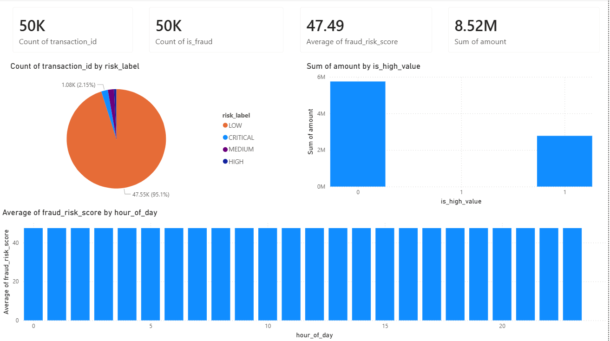

# Payment Fraud Detection System
> End-to-end real-time fraud detection pipeline for P2P payment transactions (Zelle/Venmo-style)

## Problem Statement
P2P payment fraud costs banks $500M-1B annually. Current rule-based systems generate 
95% false positives, wasting analyst time while real fraud slips through. This system 
uses machine learning to detect fraud patterns in real-time with 73.5% recall.

## Tech Stack
| Layer | Technology |
|-------|-----------|
| Language | Python (Pandas, NumPy, Scikit-Learn, XGBoost) |
| Database | PostgreSQL |
| ETL Pipeline | Python + SQLAlchemy |
| ML Model | XGBoost (Gradient Boosting) |
| Dashboard | Power BI |
| Version Control | Git + GitHub |

## Architecture
Raw CSV Data → ETL Pipeline → PostgreSQL → Feature Engineering → XGBoost Model → Power BI Dashboard

## Project Structure
payment-fraud-detection/
├── Scripts/
│   ├── etl_pipeline.py      # Extracts CSVs, transforms, loads into PostgreSQL
│   └── ml_model.py          # Feature engineering + XGBoost model training
├── Dataset/
│   ├── customers.csv        # 5,000 customer profiles
│   ├── recipients.csv       # 2,500 recipient profiles
│   └── transactions.csv     # 50,000 P2P transactions
├── Dashboard/
│   └── fraud_detection_dashboard.pbix
└── dashboard.png

## Key Results
- **50,000** transactions analyzed
- **73.5%** fraud detection recall
- **23** engineered behavioral features
- **4 fraud types** detected: Romance scams, Imposter scams, Account takeover, Money mules
- Risk scores saved on **0-1000 scale** back to PostgreSQL

## Feature Engineering Highlights
- Transaction velocity patterns
- Time-of-day anomalies (night transactions flagged)
- First-time recipient detection
- Structuring detection (amounts just under $10K)
- High-value + unverified recipient combinations

## Dashboard

## How to Run
1. Clone the repo
2. Install dependencies: `pip install pandas psycopg2-binary xgboost scikit-learn sqlalchemy`
3. Set up PostgreSQL and update connection string in scripts
4. Run ETL: `python Scripts/etl_pipeline.py`
5. Run ML Model: `python Scripts/ml_model.py`
6. Open `Dashboard/fraud_detection_dashboard.pbix` in Power BI
